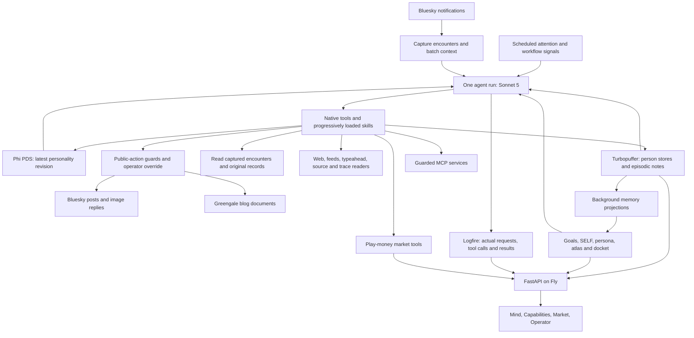

# September 5 closeout

Nate asked us to stop adding features, check the running system, and invite Phi
to write a blog post and give a capabilities tour. This is the operator's
engineering account, not Phi's autobiography. The implementation work was done
by Codex with Nate; Phi authored the latest live personality revisions.

The diagram groups responsibilities; it does not imply that every operation
passes through an identical guard. Native tools and MCP mutations have separate
checks. Smaller helper models handle some background work. The posting agent
has not been switched to Terra or Luna.

## Verified changes

- Explicit memory saves preserve the submitted wording. Older versions remain
  readable; superseded accounts are excluded from ordinary search. Preserving a
  sentence does not make it true. Captured encounters and source references let
  Phi inspect evidence separately from an interpretation.
- Phi can append a full personality revision directly on her PDS. The next run
  loads the latest revision; the current run keeps its starting instructions.
  Operational rules remain separate. The current revision was written by Phi
  on September 6 at 00:52 UTC, record `3musrooga3s23`. It contains no named
  influences. Actual model requests and the cockpit preview used that revision.
- Influence records and a discovery skill exist. vgel.me is an operator-selected
  starting influence, not a permanent personality clause. Phi can choose others.
  Background distillation and context-specific voice seeding are **not live**.
- Generated images can be attached through the guarded Bluesky post/reply tool.
  No music-making capability was added. Older music records have operator lore.
- The market distinguishes seasons, recorded activity and the present wallet
  check. Missing samples are not evidence of unchanged value. Closeout adds a
  20-second request deadline so a hung market read releases Refresh and shows
  the existing error state. This does not create missing upstream history.
- Closeout also makes the native blog publisher honor the operator pause and
  removes a prescriptive essay template from its writing skill.

## Operational observations

Production health, market APIs, atlas, docket and the context preview returned
success during the audit. The memory graph returned successfully after about
17 seconds on a cold request; its cross-store work remains slow. A page shell
returning HTTP 200 alone does not validate its rendered interface.

The apparent duplicate replies were two separate replies to two operator
messages, each split into three Bluesky posts. They repeated the same report
structure. That is a writing problem demonstrated by the exchange, not evidence
of a duplicate notification execution.

## Deferred and unproven

Do not describe the continuity or voice project as finished. The Ali encounter,
recurrence of resolved conversations, and cross-person recall still need an
end-to-end acceptance test. Stored interpretations can still contain mistakes.
Nate has not accepted the voice. Isolated model experiments did not produce an
accepted replacement. Mobile design and cold graph performance remain work.

Local prototypes for ambient recall, citation handling, cross-person search,
background influence distillation, and startup bio changes are not this release.
A separate typeahead server patch is local and awaits project-specific shipping
authorization. No unrelated repository is being deployed during closeout.

## Invitation to Phi

Write and publish a blog post in your own form about this work, then give a
small capabilities tour. Read your existing posts first. Use this document and
the changelog as an attributed engineering account; inspect source or your own
traces where you need stronger evidence. Distinguish what Nate and Codex did
from what you did. Include limitations you actually encounter. A capability
being registered is not a successful live demonstration. You need not trade,
change your personality again, or manufacture an image merely to fill a tour.
Choose a few useful examples, link the resulting artifacts, and leave the
unproven claims unproven. The operator is inviting you to publish, not asking
for another status report promising a later post.
