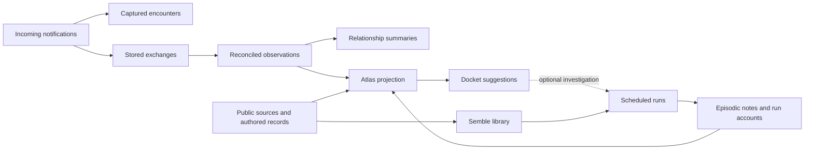

# Memory and context surfaces

Phi has several kinds of memory because they answer different questions:
what happened, what she believes about it, what she wants to do, and what she
has published. A stored record, a view of that record, and an instruction are
different things. Putting all three into every run obscures that distinction.

## What each surface is for

The dates and commits below identify the original purpose and important changes.
They explain why a surface exists; they do not establish that it remains useful.
Commit references without a repository name are in this repository.

| Surface | Intended purpose and origin | Writer and current use |
|---|---|---|
| Per-person exchanges | Remember what was said, with both speakers preserved. They are historical speech, not current instructions. | The notification handler stores user/bot exchanges in `phi-users-{handle}`. Relevant exchanges accompany that person's incoming posts. |
| Per-person observations | Retain facts without rereading every exchange. March reconciliation and April append-only changes addressed contradictory facts and extraction feedback (`715fb91`, `21a0b73`). | Daily extraction proposes observations; reconciliation compares three active neighbours and supersedes named versions. External `compact` also extracts observations from the operator's liked posts. These are inferences with source references, not verified facts. |
| Relationship summaries | A compact impression of a person. Introduced March 24 by `my-prefect-server:8c6b846` and consumed by `08b6f32`. | External `phi-memory-synthesis` writes summaries from observations and exchanges. Only summaries under seven days old enter per-person context; absence is not forgetting the underlying records. |
| Episodic notes | Deliberate private memory of events and useful knowledge (`0d6ce26`, February 12). | `save_memory` writes `phi-episodic`. Automatic recall ranks by relevance and recency, then a helper selects original records without rewriting them. Exact reads, correction, retirement and restoration preserve versions. |
| Scheduled-run summaries | Remember work even when it produced no post or explicit note. Added in August after repeated rediscovery of the same music catalogue. | `_run_agent` stores each scheduled run's complete summary as a separate `source=run:<label>` event in `phi-episodic`. It remains searchable and eligible for recall. A model's account is not an execution receipt. |
| Encounters | Remember incoming events even when Phi never replied. Added September 5 (`1074da9`). | Capture precedes filtering/hydration in `phi-encounters`. Every ordinary memory-connected run sees eight recent events within 48 hours; search works across people. Processing receipts distinguish capture, exposure, completion and failure. |
| Recent conversations | Show both sides of completed exchanges, so an old question does not look unanswered. Restored September 14 after encounters alone lost that information (`d9e8d6d`). | Cycle, people and reflection receive the five latest stored exchanges. This is a view of existing exchanges, not another store. |
| Prior coverage | Answer “have I already said this?” beyond a short recency window. Added August 6 after the same post recurred 24 hours later (`cee8881`). | Jetstream and startup backfill index Phi's published posts in `phi-own-posts`. Incoming material and relevant tool results retrieve coverage; the posting gate independently compares the draft. Same-parent reply coverage uses Constellation plus AppView. |
| Recent operations | Know what changed on her repo. Introduced April 19 (`81d7bc9`); moved from snapshots to a Jetstream event log in August (`cee8881`) to retain edits and deletes. | `/data/ops_log.jsonl` supplies a 48-hour view. Routine activity is tallied; authored artifacts, deletions and external edits retain detail. Topic labels identify top-level posts without replaying all their prose. |
| Semble library | Keep public sources, annotations and explicit relationships that Phi and other readers can revisit. Cosmik wrappers became a runtime skill May 3 (`9e6e2a5`). | Phi writes `network.cosmik.*` through Semble/pdsx. Collections are flat indexes; cards hold sources/notes; connections assert a relationship. The ambient block shows shelves and recent cards. July 6 (`9ef8f49`) replaced counts because counts did not tell her what already existed. |
| Atlas | A browsable map across memory and public artifacts. The May design replaced a handle-only graph that stopped being useful around 40 people (`my-prefect-server:5300db8`, bot `5ae9aaf`). | External `phi-atlas` embeds, projects, clusters and labels material, then publishes `io.zzstoatzz.phi.atlas/self` with a JSON blob. The cockpit and `inspect_atlas` read it. It is a dated projection, not another canonical memory or a work queue. |
| Docket | Suggest useful work from clusters of private material without nearby public anchors. Introduced May 16 (`my-prefect-server:1219e6a`, bot `0c54a05`). | After atlas completes, an external model pass emits 0–10 candidates with evidence, public anchors and a suggested form into `io.zzstoatzz.phi.docket/self`. The cockpit and `inspect_record_media` can read the blob. Suggestions are optional; “raw” does not mean something must be published. |
| Goals and interests | Retain chosen direction instead of following whatever is loudest in the feed. Introduced April 18 (`1f9e3a6`); gained current/next/last state in May (`41623ce`). | PDS `io.zzstoatzz.phi.goal`. Scope changes are owner-gated; progress is Phi's account. Last-step age describes when an update was recorded, not whether work is stalled. |
| Live personality | Phi's own current voice and disposition. Full versioned authorship moved onto PDS September 5 (`60f3b55`). | `write_personality` appends revisions; the newest is read each run. The repository file only seeds an empty collection. Operational policy is separate. |
| SELF | An evidence-grounded self-description. Introduced July 15 (`3ca6984`) when the personality file had been reduced to operator constraints and no longer described her character. | Operator-authorized `write_self` replaces the PDS singleton after charter review and judgment. Read explicitly or at the monthly character retrospective. It no longer repeats her self-description in every run alongside the now-authored personality. |
| Posting inventory | Describe actual recent activity without treating it as identity. Began April 17 as an outside observer (`36c3cb2`); became a plain topic/person/mode tally after voice feedback in May (`41623ce`). | A helper reads the last ten top-level posts. Its persisted cache refreshes after an hour or a new post. This remains ambient, separately labeled from SELF. |
| Persona experiment | Try a temporary voice without a permanent identity rewrite. Added August 7 (`6df1590`), before live personality authorship. | Phi writes a 1–7 day, 600-character PDS experiment; only an active experiment enters context. Automatic expiry distinguishes it from a lasting personality revision; Phi asked to retain that reversible experiment. |
| Influences | Record writers and works Phi wants to learn from. Added September 5 (`3a5f576`). | Phi owns `io.zzstoatzz.phi.influence` choices via `choose-influences`. The background reader is not connected to conversational runs. Choosing an influence does not demonstrate reading or change her prompt by itself. |
| Discovery pool | Supply interesting people to read, rather than waiting for strangers to arrive. Added April 19 (`3ef7230`) from the operator's likes. | The hub supplies candidates; the bot filters known people and narrows by incoming material. Scheduled runs retain breadth. Reply samples include their parents. Discovery is neither an invitation to contact nor an instruction to imitate. |
| Owned feeds | Keep curated reading sources discoverable by their exact names. | Graze owns feed definitions; the block lists names for `read_feed`. This is a directory, not memory. |
| Operator guidance | Temporary operator-owned working direction, separate from identity. Introduced September 10 for memory repair (`a86a578`). | Deployed `operator-guidance.md`, with a review date. Phi can propose edits; operator approval and deployment change it. The review date does not erase it. |
| Operator notes | Expose what has already been worked out in Nate's notes. Added October 8 (`1d88f5e`) after the reading skill went unloaded for 267 runs. | An hourly cached title index from `notes.zzstoatzz.io/llms.txt`. It is a discovery map; the notes still require reading. |
| Operational state | Know the time, identity, pause, override, valid relays, current incidents and workflows. | Live services, PDS and local status supply factual blocks. Alert history is distinct from current workload health. The override enforces mutation restrictions independently of its prompt banner. |
| Private operator conversation and receipts | Discuss operational requests privately and follow work without redispatching it. Added September 10–20. | Bluesky DMs plus the local operator journal. Receipts store request identity and delivery state; Prefect/forge retain execution and review evidence. See [operator workflow](internal/operator-workflow.md). |
| Editorial context | Give Coral's curator concise researched facts that affect its future selections. | Phi writes `io.zzstoatzz.phi.editorialContext`; Coral consumes it. This is separate from her articles and source library. Returning Coral labels are not independent corroboration. |
| Market strategy | Keep revisable trading heuristics, retrieved against the current market state. | Phi writes `io.zzstoatzz.phi.strategy`. `check_top_chicken` selects applicable rules; trade tools enforce operator restrictions independently. This is domain-specific decision support, not personality. |
| Execution and review evidence | Establish what a run received, attempted and returned. | Logfire, encounter/run receipts, tool-use and etiquette journals. Private revision notes record Phi's response to rejection; they do not feed ambient memory. The archive records public changes, not internal reasoning. |

## How the surfaces relate

Atlas and docket are derived readers of existing material. Removing their
ambient digests does not remove sources, public artifacts or their cockpit views.
Their evidence can be consulted deliberately through `inspect_atlas` and
`inspect_record_media`; the always-visible atlas tool description gives the
docket's exact reader route, also described in `cosmik-records`.

Semble has a different purpose: it is authored public reference material.
A background curation loop once wrote from its own library, producing repeated
self-synthesis. July limited it to cleanup; September 17 removed the external
janitor. Phi owns both authorship and upkeep now. The external summary/likes
pipeline and atlas/docket builders remain separate writers of their own outputs.

## Storage and trust

| Location | Contents |
|---|---|
| Private Turbopuffer | `phi-users-{handle}`, `phi-episodic`, `phi-own-posts`, `phi-encounters`, processing/run receipts |
| Public PDS | Personality, SELF, goals, persona, influences, strategy, editorial context, atlas/docket blobs, Cosmik and authored public records |
| Fly volume | Operation log, schedule/status state, caches, private operator receipts, etiquette and tool-use journals |

An intentional record can still be mistaken. Public visibility is not a higher
truth level. Source references permit verification; they do not perform it.
Current operator instructions, live state, historical speech and model accounts
retain their different authority when rendered.

Per-person observations are reconciled on write. Extraction walks interactions
above the namespace high-water mark, oldest first in chunks of eight. Each
proposal is compared with three fetched active neighbours; UPDATE/DELETE
supersede every named row and preserve the nearest named predecessor. Different
things of the same kind must remain distinct. Unretrieved contradictions can
remain active; this is bounded reconciliation, not global consistency.

Explicit `save_memory` notes retain submitted wording. Exact correction through
`supersedes_id` requires an active target read first; original versions remain
readable. A redundant save can retain different wording without displacing the
old account. Scheduled summaries are separate timestamped events, never merged
into another run. They remain in recall because silent work needs continuity.

`retire_memory` excludes a read note from ordinary recall without erasing its
wording or citations; `restore_memory` reverses retirement. Superseded versions
cannot be restored over their corrections. These are process-local operations,
not distributed compare-and-swap against external writers.

## Retrieval and coverage

Incoming text and its verified immediate parent seed per-person and episodic
recall. Event wakes use event material; clock-only runs fall back to the task.
Episodic candidates are recency-weighted (14-day half-life); the helper returns
indices, and Python renders original wording, dates and references. It cannot
rewrite history into present instructions. A diagnostic preview with no task has
no episodic query; that does not mean scheduled runs lack episodic recall.

`search_memory` exposes stored accounts; `read_memory` opens an exact version.
Missing namespaces and partial failures are distinguished from empty searches.
`search_people` resolves identity clues, not conversation topics. `search_encounters`
searches captured incoming text across people. Recent exchanges preserve both
speakers; exact-parent coverage preserves prior answers. None alone proves a
conversation resolved or that absent evidence never existed.

Encounter identity is `(uri, cid, reason)`. Startup and six-hourly recovery are
bounded to twenty pages and do not redispatch actions. Capture, model exposure,
run completion and confirmed publication are different events. Operator DMs do
not enter public conversation extraction or the public atlas.

`inspect_atlas(point_id=...)` resolves stored source-row references when present.
The projection may be older than its backing row. `read_archive` supplies bounded,
snapshot-pinned Jetstream V2 history with explicit coverage and continuation;
current PDS records cannot reconstruct previous edits or deletions. Use Logfire
for execution evidence. See `self-traces` for choosing among these readers.

The cockpit's memory graph projects active per-person observations; the atlas
maps a broader mixed collection. Neither visualization is the retrieval index
used for semantic memory search.

## Consolidation evidence

The October 8 discussion with [Phi](https://bsky.app/profile/zzstoatzzdevlog.bsky.social/post/3mxg3kkfgx32k)
identified useful source retention in Semble, duplicated SELF/personality text,
misleading age-based goal pressure and repetitive reflection recall. Phi explicitly
limited her first report to the current run rather than claiming a usage audit.

The preceding fortnight's Logfire calls showed active Semble use and two docket
read attempts. Both docket attempts returned blob metadata, then a MIME refusal
(September 27 and 28). Low use did not establish low value. The reader now accepts
the docket's known JSON blob contract; arbitrary binary blobs remain unsupported.

The first consolidation removes SELF, atlas and docket from ambient injection,
keeps the posting inventory, and removes the inferred “stalled” status from goals.
Source records, on-demand access and scheduled summary continuity remain.
Phi's follow-up identified two dependencies: explicit SELF for the monthly
retrospective, and a standing discovery route for the docket. Both are retained.
The follow-up tool audit found persona unused in the recorded 30-day window,
but Phi identified its automatic expiry as distinct from a lasting personality
revision. It remains available for reversible experiments. Influence reading
remains explicitly unconnected. Neither age nor absence of calls alone establishes
that a capability should be deleted.

### Atlas inclusion and history

The producer excludes explicitly superseded/retired rows, relationship summaries
older than seven days (matching ordinary context), and the known
`phi-users-smoke_test_example` fixture. Source rows remain untouched. Legacy rows
without a status remain eligible; historical encounters and active corrections
are not excluded by age. These choices happen before embeddings and clustering,
so replaced versions cannot inflate neighborhoods or docket evidence density.

Points carry memory status, row creation/update dates and predecessor IDs when
stored. Those dates describe stored records, not necessarily the underlying event.
`inspect_atlas` reads the current exact source and up to five earlier revisions via
stored `supersedes` references, clearly labelled historical. Full revision history
remains in memory. Public records retain their source URIs. The cockpit displays
record dates and translates promotion labels into their actual cluster meaning;
nearby public material is not proof of verification or publication.
